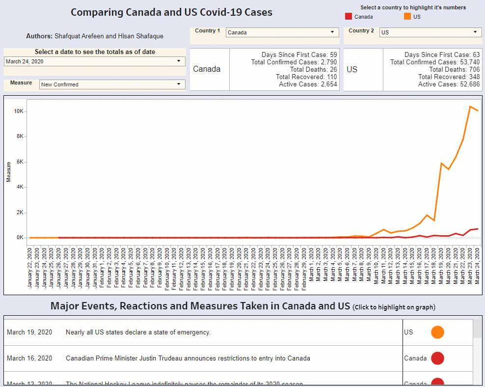

# Comparing Daily Covid-19 Cases Between Countries
## [The Dashboard](https://public.tableau.com/profile/hisan.shafaque#!/vizhome/ComparingCovid-19inDifferentCountries/Covid)

This project used python to transform the [JHU Covid-19 dataset](https://github.com/CSSEGISandData/COVID-19/tree/master/csse_covid_19_data/csse_covid_19_daily_reports).

We performed the following analysis in the [Jupyter Notebook](https://github.com/Shafquat/COVID-19_day_count/blob/master/Merge_Data_add_Day_Count.ipynb):
* Consolidated the daily files
* Editted the data quality for different spellings of the same country
* Grouped the data by country
* Calculated Active Cases
* Calculated Daily occurences of Cases, Deaths, and Recoveries
* Added in news events in a separate table

The goal is to discover trends and analyze the data to identify which countries are effectively tackling the Covid-19 crisis.

This is a collaborative effort by [Hisan Shafaque](https://www.linkedin.com/in/hisan-w-shafaque/) and [Shafquat Arefeen](https://shafquatarefeen.com)

## Data Sources: 

[Johns Hopkins University](https://github.com/CSSEGISandData/COVID-19/tree/master/csse_covid_19_data/csse_covid_19_daily_reports)

[Wikipedia Timeline of the 2019–20 coronavirus pandemic](https://en.wikipedia.org/wiki/Timeline_of_the_2019%E2%80%9320_coronavirus_pandemic)

### Prerequisites

Python and Jupyter Notebook are required to run the iPython Notebooks

Tableau Desktop is required to run the visualization. You can find an online version of the work on [Tableau Public](https://public.tableau.com/profile/hisan.shafaque#!/vizhome/ComparingCovid-19inDifferentCountries/Covid).

## Authors

* **Hisan Shafaque** - [Hisan Shafaque](https://github.com/hisanshafaque)

* **Shafquat Arefeen** - [Shafquat Arefeen](https://github.com/Shafquat/)
